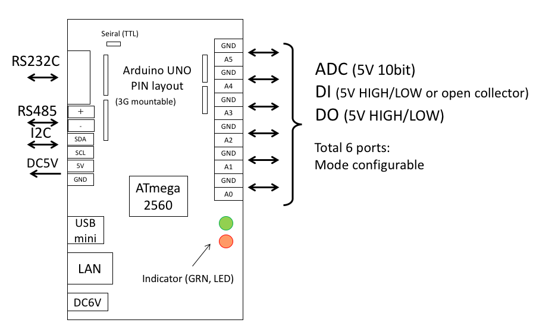
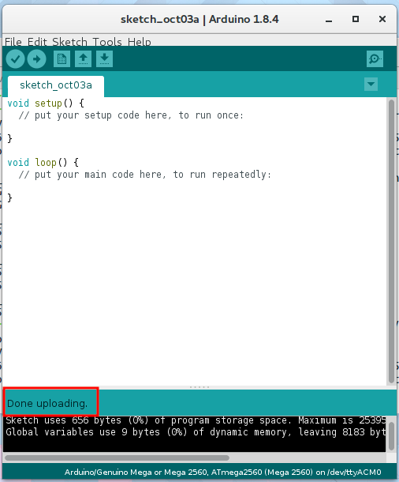

# M2M Gateway preparation

## Power Supply

The M2M gateway can accept an input voltage of 6V to 12V,a center positive AC adaptor can be used.

## Arduino settings

### Change the board setting

First, connect the M2M gateway to your computer with a USB cable. Next, select the Arduino board under "Tools" → "Board" → "Arduino/Genuino Mega or Mega 2560" Then under "Processor", select "ATmega 2560 (Mega 2560)". It is important to ensure that the correct processor is selected.

When you connect the M2M gateway to your computer, the drivers will automatically install. The device will be displayed under "Tools" → "Port". If there are multiple Arduinos or serial communication devices connected to your computer, multiple devices will be shown under "Port". Ensure that the correct Arduino is selected.

### Uploading to the Arduino

It's finally time to upload a program to the M2M gateway

Click the upload button in the upper left corner of the Arduino window.

If the uploading is successful, you will see a confirmation message saying "Done uploading"

If the uploading fails, check the settings and connection carefully, then try uploading again.
