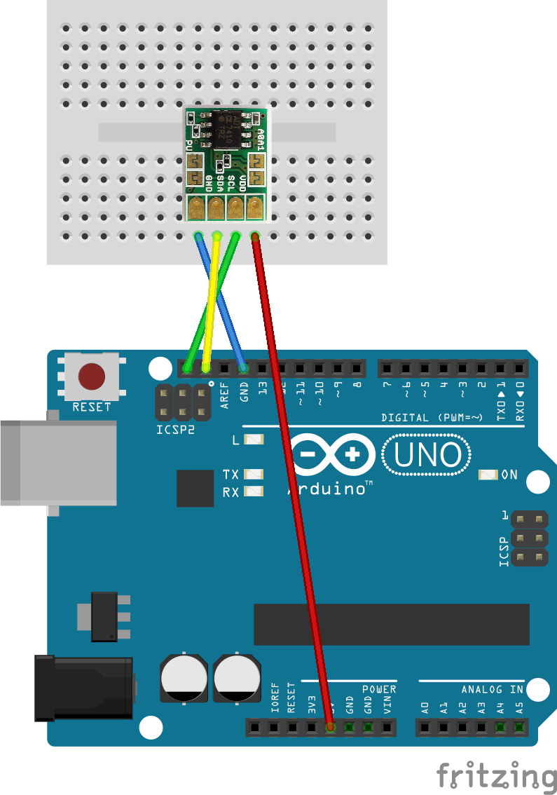
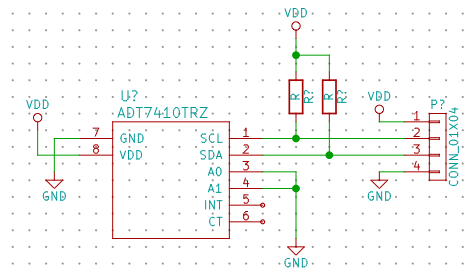

## ADT74x0(Temperature Sensor)

This is a temperature sensor that can use I2C(Wire)

### Circuit Connection

When using [Akizuki's AD7410 module](http://akizukidenshi.com/catalog/g/gM-06675/),The Arduino's internal pull up resistor can be used in order to reduce the number of parts used. However, when using the Arduino's internal pull up resistor for I2C, it is prone to getting errors. Thus an external pull up resistor is recommended.


In addition, the circuit connectons for using this chip alone are as shown. Please connect the `Vcc`，`GND`，`SCL`，`SDA` in the same way as when using the Akizuki module.


### Program

ADT74x0 has an Arduino library
*
Please refer to [Using Libraries](../using-libraries/README.md)for how to install [ADT74x0](https://github.com/PlantFactory/ADT74x0) library.

```C++
#include <Wire.h>
#include <ADT74x0.h>

ADT74x0 temp_sensor;

void setup() {
  Serial.begin(9600);
  Wire.begin();
  temp_sensor.begin();
}

void loop() {
  Serial.print("Temp:");
  Serial.println(temp_sensor.readTemperature());
  delay(1000);
}
```

### Resources used

* [Fritzing Library - MozOpenHard](https://github.com/MozOpenHard/examples/tree/master/i2c-ADT7410)
