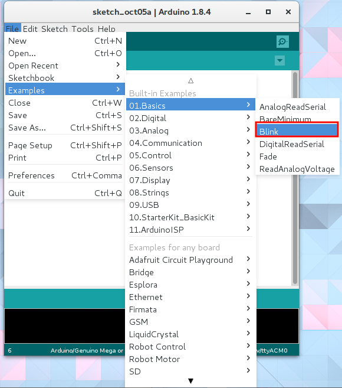
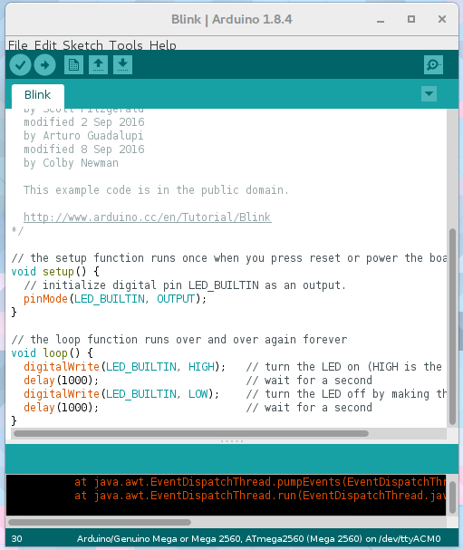
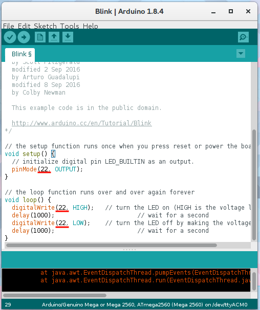

## LED blink

The first thing to do after buying a microcontroller to make an LED blinker. Let's learn how to call up Arduino's official sample, and at the same time check the board's operation.

### 1. Choose blink from the official samples

Arduino has an official sample collection built in. Let's select files → 01.Basics → Blink. Furthermore, samples for additional installed libraries are also displayed here. If you are unsure how to use any of the libraries, don't hesitate to refer to the samples provided.

If you are using an official Arduino board, the LED is built in, so it is OK to keep it as it is.

When using the M2M gateway, we have to change the pin number because the LED is connected to a different pin. Let's change the part written as `LED_BUILTIN` of the source code to` 22`.

### 2. Upload and execute

All that's left now is to change the [upload settings](../../2-m2m-gateway-prepare/README.md#arduinoから書き込み)
, then click on the upload button.

Is the LED blinking every second?
