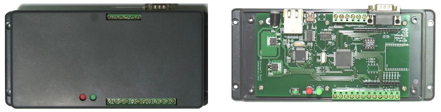
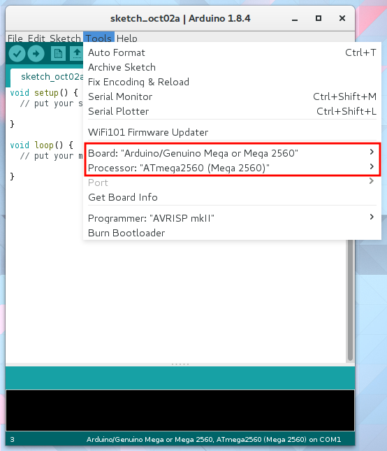
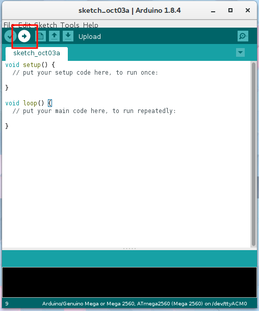

# M2Mゲートウェイの準備

## 電源

電源は6Vから12V，センタープラスのACアダプタが使用できます．

## Arduinoから書き込み

### 書き込みボード設定

まず，M2MゲートウェイをUSBケーブルでパソコンに接続します．次に，Arduinoを正しく書き込めるように設定します．Arduinoのツール→ボード→"Arduino/Genuino Mega or Mega 2560"を選択します．必ずプロセッサーが"ATmega 2560 (Mega 2560)"が選択されていることを確認してください．

M2Mゲートウェイをパソコンに接続すると自動的にドライバーがインストールされ，ツール→ポートに表示されます．パソコンに複数のArduinoやシリアル通信機器が接続されている場合，複数表示されます．当該Arduinoの接続ポートを選択しましょう．

### 書き込み

いよいよM2Mゲートウェイにプログラムを転送します．

Arduinoウィンドウ左上の書き込みボタンをクリックします．

正常に転送できた場合，このような表示になります．

失敗している場合，設定や接続をよく確認して再度書き込んでみましょう．
