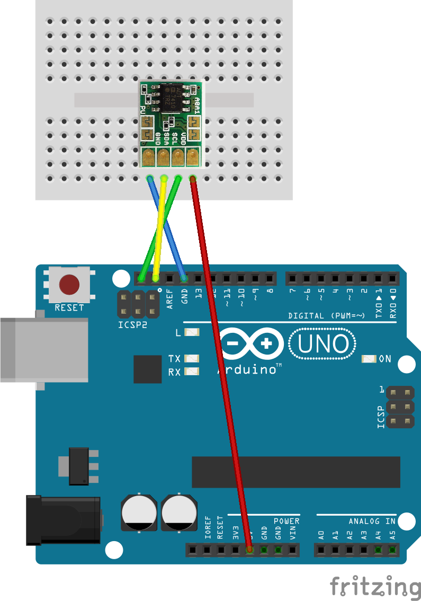

## ADT74x0(温度センサー)

I2C(Wire)で使用できる温度センサーです．

### 回路

[秋月のADT7410モジュール](http://akizukidenshi.com/catalog/g/gM-06675/)を利用する場合，Arduinoの内蔵プルアップ抵抗を利用すれば最小限のパーツで通信できます．Arduinoの内蔵プルアップ抵抗でI2Cを利用すると，エラーになりやすいので，外部プルアップ抵抗を利用することをおすすめします．


なお，チップ単体で利用する場合の回路はこんな感じです．`Vcc`，`GND`，`SCL`，`SDA`は秋月のモジュールを利用するときと同じように接続してください．


### プログラム

ADT74x0はArduinoライブラリがありますので利用します．
* [ADT74x0](https://github.com/PlantFactory/ADT74x0)
インストール方法は[ライブラリの使用](../using-libraries/README.md)を見てください．

```C++
#include <Wire.h>
#include <ADT74x0.h>

ADT74x0 temp_sensor;

void setup() {
  Serial.begin(9600);
  Wire.begin();
  temp_sensor.begin();
}

void loop() {
  Serial.print("Temp:");
  Serial.println(temp_sensor.readTemperature());
  delay(1000);
}
```

### 利用させていただいた素材

* [Fritzingライブラリ - MozOpenHard](https://github.com/MozOpenHard/examples/tree/master/i2c-ADT7410)
