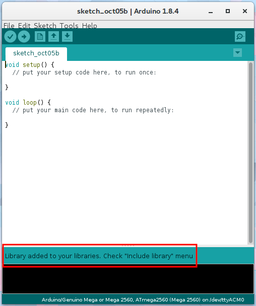
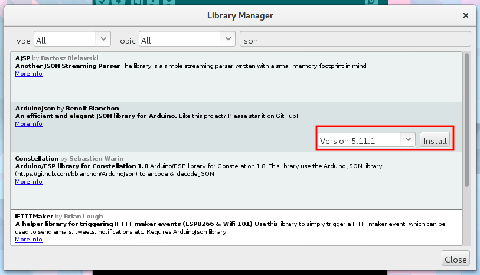
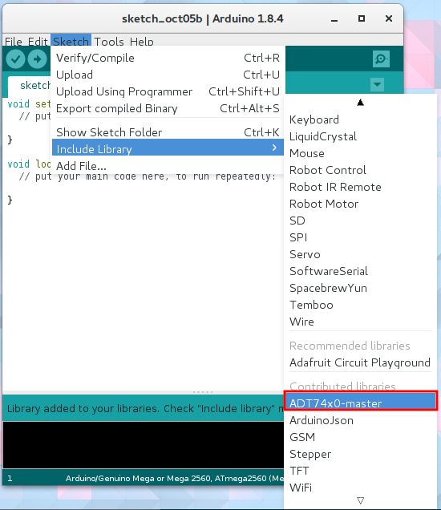

## ライブラリの使い方

Arduinoを使う上で一番のメリットである豊富なライブラリを使えるようにしましょう．

### ライブラリのインストール

ライブラリのインストール方法は以下の３つです．

* 直接librariesディレクトリへコピーする
* ZIP形式でダウンロードし，インストールする
* ライブラリマネージャからインストールする

#### 直接librariesディレクトリへコピーする

Arduinoはスケッチやユーザーごとのライブラリを管理するディレクトリを作成します．Windowsの場合は`%USER_PROFILE%\Documents\Arduino`，Linuxは`~/Arduino`，macOSは`~/Documetns/Arduino`にあります．（設定によっては異なります）そのディレクトリに`libraries`ディレクトリがあると思いますが，ここがライブラリのインストール先です．

ここにライブラリ名のディレクトリを作成し，ライブラリのヘッダーやソースを設置して終了です．

#### ZIP形式でダウンロードし，インストールする

一般的にArduinoのライブラリはZIP形式で圧縮して配布されています．この形式はArduinoのメニューから簡単にインストールできます．

例としてADT74x0ライブラリをインストールしてみましょう．

まず，ライブラリをダウンロードします．Githubで公開されているArduinoのライブラリは構造的にそのままインストールできることが多いです．GithubからZIP形式でダウンロードしましょう．

Arduinoのスケッチ→ライブラリのインクルード→.ZIP形式のライブラリをインストールを選択してください．

先ほどダウンロードしたZIPファイルを選択しましょう．

この表示が出れば正常にインストールされました．

#### ライブラリマネージャからインストールする

Arduinoにはライブラリマネージャがあります．ライブラリにアップデートがあった場合に自動的に通知されるなど便利です．ただ，これは対応しているライブラリが限られます．まずインストールしたいライブラリを検索し，ヒットしなかったときはZIP形式インストールや直接インストールを試してください．

ライブラリマネージャを開くには，スケッチ→ライブラリのインクルード→ライブラリを管理をクリックします．

ライブラリマネージャが開いたらライブラリを検索，インストールしたいライブラリをクリックするとバージョン選択とインストールボタンが出現します．バージョンを選択した後，インストールボタンを押すことでダウンロード，インストールが開始されます．

### ライブラリのインクルード

ライブラリをスケッチで使用するためにはヘッダファイルのインクルードが必要です．手書きで`#include...`と入力しても動作しますが，Arduinoに認識されているライブラリの場合，自動的に追加できます．

ライブラリをインクルードするには，スケッチ→ライブラリのインクルードを開きます．ライブラリの一覧が表示されるので，インクルードしたいライブラリをクリックします．

するとスケッチの上部に選択したライブラリの`#include...`が追記されます．

